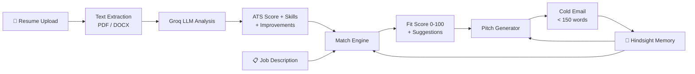

<div align="center">

# 🤖 AI Job Agent

### Your AI-Powered Career Autopilot

An intelligent full-stack platform that automates your job search — from resume analysis to smart applications and AI-crafted outreach pitches. Built with **Next.js 16**, **FastAPI**, **Groq (Llama 3.3 70B)**, and **Hindsight** for persistent agent memory.

[](https://nextjs.org/)
[](https://fastapi.tiangolo.com/)
[](https://groq.com/)
[](https://python.org/)
[](https://typescriptlang.org/)
[](https://hindsight.vectorize.io/)
[](https://docker.com/)

---

</div>

## ✨ Features

| Feature | Description |
|---|---|
| 📄 **Resume Analyzer** | Upload PDF/DOCX resumes and get instant AI-powered ATS scoring, skill extraction, and improvement suggestions |
| 🧠 **AI Match Scoring** | Groq-powered Llama 3.3 70B calculates fit scores between your resume and job descriptions |
| ⚡ **Quick Apply** | One-click AI application that auto-generates match analysis and submits applications |
| ✍️ **Outreach Pitch Generator** | AI crafts personalized, persuasive cold emails to hiring managers in under 150 words |
| 📊 **Kanban Tracker** | Track all applications across stages — Applied, Interviewing, Offer, Rejected |
| 🔐 **Authentication** | User sign-up and login with hashed password storage |
| 📈 **Analytics Dashboard** | Overview of resumes, ATS scores, active applications, and recent activity feed |
| 🔮 **Hindsight Memory** | Persistent agent memory that remembers past interactions, prevents duplicate outreach, and learns from outcomes |

---

## 🏗️ Architecture

```
job-application-agent/
├── backend/                    # FastAPI Python Backend
│   ├── main.py                 # App entry point, CORS, router mounting
│   ├── database.py             # SQLAlchemy engine + session config
│   ├── models.py               # ORM models (User, Resume, Job, Application)
│   ├── schemas.py              # Pydantic request/response schemas
│   ├── routers/
│   │   ├── auth.py             # Sign-up & login endpoints
│   │   ├── resumes.py          # Resume upload & AI analysis
│   │   ├── jobs.py             # Job listing CRUD
│   │   ├── apply.py            # Application + match scoring + pitch gen
│   │   └── activity.py         # Activity feed aggregation
│   ├── services/
│   │   └── ai_service.py       # Groq API integration (analyze, match, pitch)
│   ├── utils/
│   │   └── parser.py           # PDF/DOCX text extraction
│   ├── Dockerfile              # Production container config
│   └── requirements.txt        # Python dependencies
│
├── frontend/                   # Next.js 16 React Frontend
│   ├── src/
│   │   ├── app/
│   │   │   ├── dashboard/      # Overview stats & activity feed
│   │   │   ├── resume-analyzer/# Upload zone + AI scoring UI
│   │   │   ├── job-matches/    # Job cards + quick apply buttons
│   │   │   ├── tracker/        # Kanban board + pitch modal
│   │   │   ├── login/          # Authentication page
│   │   │   └── signup/         # Registration page
│   │   ├── components/
│   │   │   └── Sidebar.tsx     # Navigation sidebar
│   │   ├── lib/
│   │   │   └── api.ts          # Axios API client layer
│   │   └── providers/
│   │       └── PostHogProvider # Analytics wrapper
│   └── package.json
│
└── .gitignore
```

---

## 🚀 Getting Started

### Prerequisites

- **Python** 3.11+
- **Node.js** 18+
- **Groq API Key** — [Get one free here](https://console.groq.com/keys)

### 1. Clone the Repository

```bash
git clone https://github.com/lokeshraaj/job-application-agent.git
cd job-application-agent
```

### 2. Backend Setup

```bash
cd backend

# Create a virtual environment
python -m venv venv

# Activate it
# Windows:
venv\Scripts\activate
# macOS/Linux:
source venv/bin/activate

# Install dependencies
pip install -r requirements.txt

# Configure environment
cp .env.example .env
# Edit .env and add your Groq API key:
#   GROQ_API_KEY="gsk_your_key_here"
#   DATABASE_URL="sqlite:///./ai_job_agent.db"

# Run the server
uvicorn main:app --reload --port 8080
```

The API will be live at **http://localhost:8080** — visit `/docs` for the interactive Swagger UI.

### 3. Frontend Setup

```bash
cd frontend

# Install dependencies
npm install

# Configure environment
# Create .env.local with:
#   NEXT_PUBLIC_API_URL=http://localhost:8080

# Run the dev server
npm run dev
```

The app will be live at **http://localhost:3000**.

---

## 🐳 Docker Deployment

```bash
cd backend

# Build the image
docker build -t ai-job-agent-backend .

# Run the container
docker run -p 8000:8000 \
  -e GROQ_API_KEY="your_key_here" \
  -e DATABASE_URL="sqlite:///./ai_job_agent.db" \
  ai-job-agent-backend
```

---

## 🔌 API Reference

| Method | Endpoint | Description |
|---|---|---|
| `GET` | `/` | Health check |
| `GET` | `/health` | Health status |
| `POST` | `/api/auth/signup` | Register a new user |
| `POST` | `/api/auth/login` | Authenticate user |
| `POST` | `/api/resumes/upload` | Upload & AI-analyze a resume |
| `GET` | `/api/resumes` | List all resumes |
| `POST` | `/api/jobs` | Create a job listing |
| `GET` | `/api/jobs` | List all job listings |
| `POST` | `/api/apply` | Apply to a job (AI match scoring) |
| `GET` | `/api/apply` | List all applications |
| `PATCH` | `/api/apply/{id}` | Update application status |
| `POST` | `/api/apply/{id}/pitch` | Generate AI outreach pitch |
| `GET` | `/api/activity` | Get recent activity feed |

> 📖 Full interactive documentation available at `/docs` when the backend is running.

---

## 🧠 AI Pipeline

The AI service uses **Groq's Llama 3.3 70B Versatile** model for three core tasks, backed by **Hindsight** for persistent memory:



1. **Resume Analysis** — Extracts skills, experience, and generates ATS scores with format, keyword, and impact sub-scores
2. **Match Scoring** — Compares resume content against job descriptions to calculate a fit percentage
3. **Pitch Generation** — Crafts personalized cold emails blending candidate strengths with job requirements
4. **Memory Layer (Hindsight)** — Retains outcomes and interactions so the agent avoids redundant outreach and improves over time

---

## 🔮 Hindsight — Agent Memory

[Hindsight](https://hindsight.vectorize.io/) by **Vectorize.io** is the open-source memory engine that gives the AI Job Agent persistent, long-term recall. Instead of starting from scratch every session, the agent:

- **Remembers** which companies and HR contacts have already been reached out to
- **Learns** from past application outcomes (accepted, rejected, ghosted) to refine future strategies
- **Prevents** duplicate or redundant outreach to the same job listing or recruiter
- **Retains** user preferences, resume versions, and interaction history across sessions

### How It Works

| Operation | Purpose |
|---|---|
| `retain()` | Store new interactions — applications sent, pitches generated, status changes |
| `recall()` | Retrieve relevant memories before taking action (e.g., "Have I contacted this company?") |
| `reflect()` | Reason over past data to generate insights (e.g., "Which industries respond best?") |

> 💡 Hindsight transforms the agent from a stateless tool into one that genuinely **learns from experience** — the core principle behind agentic AI.

### Setup

```bash
pip install hindsight-api
```

Add your Hindsight credentials to the backend `.env`:

```env
HINDSIGHT_API_KEY="your_hindsight_api_key"
HINDSIGHT_BASE_URL="https://api.hindsight.vectorize.io"
```

> 📖 Full documentation: [hindsight.vectorize.io](https://hindsight.vectorize.io/)

---

## 🛠️ Tech Stack

| Layer | Technology |
|---|---|
| **Frontend** | Next.js 16, React 19, TypeScript, Tailwind CSS 4 |
| **Backend** | FastAPI, SQLAlchemy, Pydantic |
| **AI/LLM** | Groq API, Llama 3.3 70B Versatile |
| **Agent Memory** | [Hindsight](https://hindsight.vectorize.io/) by Vectorize.io |
| **Database** | SQLite (dev) / PostgreSQL (prod) |
| **File Parsing** | pdfplumber, python-docx |
| **Auth** | passlib + bcrypt |
| **Analytics** | PostHog, Vercel Analytics |
| **Deployment** | Docker, Vercel (frontend) |
| **UI** | Lucide Icons, React Hot Toast, Glassmorphism design |

---

## 📜 License

This project is open source and available under the [MIT License](LICENSE).

---

<div align="center">

**Built with ❤️ by [TEAM KALKI]**

</div>
